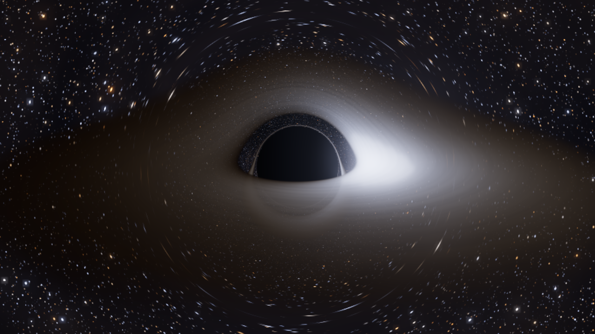

# Schwarzschild 黑洞实时模拟（广义相对论光线追踪）

浏览器里实时运行的 Schwarzschild 黑洞：每条光线都在 GPU 上逐像素求解**零测地线方程**，
背景星空被引力透镜弯折、吸积盘带有开普勒剪切与相对论性光束效应，
黑色阴影的角半径与广义相对论解析解在 0.01%–1.6% 内吻合（见 [验证](#物理正确性验证)）。



---

## 1. 运行方式

三种方式任选其一，**都不需要构建步骤**。

### 方式 A：直接打开（最快，需联网）

双击 `index.html`，或拖进浏览器。

Three.js 通过 import map 从 CDN 加载（jsDelivr），所以首次打开需要联网；
页面会显示“正在编译引力透镜着色器……”，约 1 秒后进入实时画面。

### 方式 B：本地服务器（推荐，Vite）

```bash
npm install     # 安装 three / vite / puppeteer-core（仅开发工具需要）
npm run dev     # 启动 Vite，默认 http://127.0.0.1:5173
```

浏览器打开终端里打印的地址即可。生产构建：

```bash
npm run build   # 输出到 dist/
npm run preview # 预览构建结果（http://127.0.0.1:4173）
```

构建时 Vite 会把 Three.js 一起打进 `dist/assets/`，所以 `npm run preview`
（或把 `dist/` 放到任意静态服务器上）**构建产物本身也不需要联网**。

### 方式 C：完全离线

```bash
npm install
npm run offline   # 把 three + addons 复制到 vendor/，生成 index-offline.html
npm run dev       # 用任意静态服务器打开 http://127.0.0.1:5173/index-offline.html
```

（浏览器禁止 `file://` 页面 import 本地 ES 模块，所以离线版必须经过一个静态服务器。）

> 需要支持 WebGL 2 的浏览器：Chrome / Edge / Firefox / Safari 16+。
> 集显也能跑：默认“自动”画质会根据帧率在 45%–100% 内部渲染分辨率之间自适应。

---

## 2. 操作

| 操作 | 说明 |
| --- | --- |
| 左键拖动 | 旋转视角（OrbitControls） |
| 滚轮 / 双指捏合 | 缩放（3.2 – 220 r_s） |
| 空格 | 冻结 / 继续时间。冻结后画面会自动逐帧抖动累积，收敛出干净的光子环 |
| H | 显示 / 隐藏控制面板 |
| R | 重置到默认视角 |

右侧控制台可调：吸积盘内/外半径、峰值温度、亮度、光学厚度、湍流、螺旋缠绕、
相对论光束效应开关、时间流速、星空亮度、银河强度、积分步数上限、视场角、泛光、
渲染分辨率、黑洞质量（用于读数换算）、静止累积采样；底部有 5 个预设视角、
重置视角、保存 PNG、复制视角链接（含相机与全部参数的 URL 分享）。

左下角常驻物理读数：观测者半径、静止观测者时间膨胀 `dτ/dt`、**阴影角半径**、
光子球半径与临界撞击参数、ISCO、当前质量对应的 r_s / ISCO 轨道周期、帧率与累积帧数。

---

## 3. 物理模型

全程几何单位 `G = c = 1`，长度单位为 Schwarzschild 半径 `r_s`（于是 `M = r_s/2`）。

### 3.1 零测地线积分（核心）

Schwarzschild 度规中光子轨道满足 Binet 形式

```
d²u/dφ² + u = (3/2) r_s u² ,   u = 1/r
```

为了在 GPU 上直接做三维积分，程序使用与之严格等价的笛卡尔形式
（把 `x = r n̂(φ)`、`h = r²dφ/dλ` 代入 Binet 方程即可得到，推导见附录 A）：

```
d²x/dλ² = −(3/2) r_s h² x / r⁵ ,     h = |x × dx/dλ| = const
```

每个像素用**自适应步长 RK4**积分这条方程：

- 步长同时受两个条件约束——每步径向位移 ≤ 0.18 r，每步方向转角 ≤ 0.03 rad
  （后者保证靠近光子球 r = 1.5 r_s 时自动变细）；
- `r < 1.02 r_s` 判为落入视界（该像素只保留它之前穿过的盘面发光，其余为纯黑）；
- `r > max(5 r_cam, 320 r_s)` 且向外运动判为逃逸，用逃逸方向采样背景星空。

这是**精确**的 Schwarzschild 零测地线（不是弱场近似、不是贴图造假）。

### 3.2 静止观测者的局部标架

相机位于 `r_cam`，像素给出的方向是局部正交标架中的单位矢量 `d`。
换算到坐标速度时只有径向分量被度规缩放：

```
f = 1 − r_s/r ,      v = d + (√f − 1)(d·e_r) e_r
```

于是撞击参数、守恒量都与解析式一致：`b = r sinψ / √f`
（`ψ` 为相对径向的夹角，`r` 处静止观测者看到的视角）。

### 3.3 阴影（光子捕获）

临界撞击参数 `b_c = 3√3 M = 2.598 r_s`。静止观测者看到的阴影角半径

```
sin α = b_c √(1 − r_s/r_obs) / r_obs
```

程序把这条公式实时显示在读数区，并在渲染验证里逐像素复核（下表）。

### 3.4 吸积盘

| 物理量 | 公式 | 说明 |
| --- | --- | --- |
| 角速度 | `Ω = √(M/r³)` | 开普勒圆轨道，M = r_s/2 |
| 最内稳定圆轨道 | `r_ISCO = 6M = 3 r_s` | 默认盘内缘 |
| 温度剖面 | `T(r) ∝ (r_in/r)^{3/4} (1 − √(r_in/r))^{1/4}` | Shakura–Sunyaev 薄盘，在 r = (49/36) r_in 取峰值 |
| 频移因子 | `g = 1 / [ √f_obs · u^t · (1 − Ω L_y/E) ]`，`u^t = 1/√(1 − 3M/r)` | 观测频率 / 发射频率 |
| 强度变换 | `I_obs = g⁴ I_emit` | 相对论性光束效应（可开关） |
| 色温变换 | `T_obs = g · T_emit` | 多普勒 + 引力色移 |

发射辐射按 `I ∝ (T/T_peak)⁴`（Stefan–Boltzmann）给出，
颜色由 **Planck 定律**在 380–780 nm 上对 CIE 1931 色匹配函数积分、
再转线性 sRGB 并归一化到单位亮度得到（`tools/gen-blackbody-lut.mjs` 生成 32 级查找表）。

盘被当成半透明薄层：光线每穿过一次赤道面就按光深 `τ ∝ 密度 / |cos i|` 做前向合成。
因此**一级像、二级像（盘背面被引力弯折上来的像）、光子环都自然出现**，
近侧盘面也会正确遮挡远侧的像。湍流图案在 `(角度, log r)` 上做差动旋转
（`Ω(r)` 随半径变化，形成开普勒剪切），所以内圈转得比外圈快。

### 3.5 背景

逃逸方向采样程序化星空：4 层球面网格恒星（黑体色温 2600–13000 K，按幂律分布亮度）、
银河带与星云 fbm、以及极暗深空底光。全部使用与主光线相同的逃逸方向，
所以星空同样被引力透镜弯折（爱因斯坦环、视界附近的星像拉伸）。

---

## 4. 物理正确性验证

三个验证脚本都可以直接运行（需要 Node ≥ 18，前两个不需要浏览器）。

### 4.1 `npm run verify` — 测地线积分器（纯数值，独立参考）

`tools/verify-physics.mjs` 用三种相互独立的方法交叉验证：

1. **精确积分**：`α = 2∫₀^{u_p} du/√(1/b² − u² + r_s u³) − π`，
   用 `u = u_p(1 − t²)` 换元消除端点平方根奇点后做复合 Simpson（机器精度）。
2. **Binet 常微分方程**：RK4 分别前向/后向积分到两条渐近线。
3. **四阶后牛顿级数**：`α = 4M/b + 15πM²/(4b²) + 128M³/(3b³) + 3465πM⁴/(64b⁴)`。

实跑结果摘要（完整输出见 [`docs/physics-verification.txt`](docs/physics-verification.txt)）：

```
b = 1000 r_s   精确积分 2.002950588e-3   Binet 2.002950591e-3 (1.4e-9)   级数 2.002950587e-3 (4.3e-10)
b =  100 r_s   精确积分 2.029996623e-2   Binet 2.029996624e-2 (5.7e-10)  级数 2.029996395e-2 (1.1e-7)
b =   20 r_s   精确积分 1.081040765e-1   Binet 1.081040765e-1 (9.9e-12)  级数 1.080962150e-1 (7.3e-5)
b =   10 r_s   精确积分 2.361359954e-1   Binet 2.361359954e-1 (2.0e-12)  级数 2.358488131e-1 (1.2e-3)
```

- `b·α → 4M + 15πM²/(4b) + …`，残差 1.2×10⁻⁸（爱因斯坦 1915 年的一阶结果）。
- 临界撞击参数用二分法求得 `b_c = 2.598076211 r_s`，与 `3√3 M` 完全一致（< 1e-9）。
- **GPU 用的笛卡尔 ODE** 与精确积分对比：步长减半时误差按 16.7 / 16.2 倍缩小
  —— 干净的四阶收敛，说明它确实是同一条曲线而不是近似。
- ISCO 由 `L(r)` 的极小值独立求得 3.000000 r_s；`Ω(ISCO) = 0.136083`。
- 频移因子在 L = 0 时退化为引力红移 `√(1−3M/r)/√f_obs`，静态发射体退化为 `√(f_em/f_obs)`。
- 略小于 `b_c` 的光线被判为捕获，略大于 `b_c` 的光线绕行 336° 后逃逸（高阶像）。

### 4.2 `npm run shot` — 真实浏览器渲染（无头 Chromium/Edge）

```bash
node tools/render-shot.mjs --w 1280 --h 720 --out screenshots/x.png
```

用 SwiftShader 软件 WebGL 真跑一遍着色器，等待累积采样收敛后截图，
并输出相机、阴影角、累积帧数、像素统计，用于确认没有着色器编译错误或黑屏。

### 4.3 `node tools/measure-shadow.mjs` — 从渲染结果反测阴影半径

关掉吸积盘、冻结画面，直接读回 canvas 像素，找出中心黑色圆盘的边界，
再按透视投影换回角度，与解析式比较（480–600 px 画面，45° 视场）：

```
r_obs/r_s    解析角半径     像素测量      相对误差
    8        17.685°       17.669°       0.09%
   12        11.964°       11.953°       0.09%
   18         8.064°        8.038°       0.32%
   30         4.884°        4.878°       0.13%
   60         2.461°        2.438°       0.91%
```

这覆盖了「相机模型 → 静止观测者标架换算 → 测地线积分 → 捕获判据 → 投影」整条链路。

### 4.4 `node tools/measure-disk.mjs` — 盘的相对论效应

同一视角下开关光束效应，统计画面左右半区（盘所在高度带）的亮度与颜色：

```
开启 I ∝ g⁴ :  左 0.1325   右 0.4468   亮暗比 3.371
关闭 I ∝ g⁴ :  左 0.2937   右 0.2933   比值 1.001
颜色 R−B    :  左 +11.2（偏红）   右 −6.1（偏蓝）
曝光        :  均值 0.180，峰值 0.949，纯白像素 0.00%
```

即：**接近侧显著增亮 3.37 倍且蓝移，远离侧变暗变红**，关闭 `g⁴` 后亮度完全对称
（但多普勒/引力色移仍然保留，因为它来自 `T_obs = g T_emit`）。

另有几张真实渲染可对照：`screenshots/black-hole.png`（默认机位，含控制台）、
`screenshots/black-hole-hero.png`（无 UI 的纯画面）、
`screenshots/black-hole-lensing.png`（关闭吸积盘，纯引力透镜星空）、
`screenshots/_offline-check.png` 与 `screenshots/_dist-check.png`
（离线版 `index-offline.html` 与 `npm run build` 产物的渲染自检）。

### 4.5 `npm run smoke` — UI 冒烟测试

用无头浏览器真实驱动界面：构建 13 个滑杆 / 3 个开关 / 3 个下拉、切换 5 个预设视角并校验
相机确实飞到目标机位、拖动滑杆后 uniform 立即同步、空格冻结与累积采样推进、H 键隐藏面板、
保存 PNG 按钮；并断言整段过程没有 JS 错误。

---

## 5. 项目结构

```
black-hole/
├── index.html                 单文件应用：UI + Three.js 场景 + GLSL 测地线积分器（可直接双击运行）
├── index-offline.html         由 npm run offline 生成的离线版（import map 指向 vendor/）
├── vendor/                    离线依赖（three.module.js + OrbitControls/后处理 addons）
├── package.json               npm 脚本与依赖
├── vite.config.js             本地开发服务器配置
├── tools/
│   ├── verify-physics.mjs     零测地线积分器的三方法交叉验证（无需浏览器）
│   ├── measure-shadow.mjs     从真实渲染像素反测阴影角半径
│   ├── measure-disk.mjs       多普勒光束/色移/曝光的像素级检查
│   ├── render-shot.mjs        无头浏览器截图 + 渲染统计
│   ├── smoke-test.mjs         无头浏览器驱动真实 UI（预设/滑杆/开关/快捷键）
│   ├── gen-blackbody-lut.mjs  Planck × CIE 1931 → 线性 sRGB 查找表生成器
│   ├── make-offline.mjs       生成本地依赖副本与 index-offline.html
│   └── check-syntax.mjs       内联模块语法检查
├── docs/physics-verification.txt   验证脚本的完整输出
└── screenshots/               渲染结果
```

> 为什么没有 `src/`？为了让「双击 `index.html` 就能看」这一条成立，
> 应用代码必须内联在该文件里（`file://` 下浏览器禁止加载本地 ES 模块）。
> 所有物理公式集中在 `index.html` 顶部的 GLSL 里，并带有中文注释。

### npm 脚本

| 命令 | 作用 |
| --- | --- |
| `npm run dev` | Vite 开发服务器 |
| `npm run build` / `npm run preview` | 生产构建 / 预览 |
| `npm run offline` | 生成离线依赖与 `index-offline.html` |
| `npm run verify` | 测地线积分器数值验证（不需要浏览器） |
| `npm run smoke` | 无头浏览器 UI 冒烟测试（预设、控件、快捷键、累积采样） |
| `npm run shadow` | 从渲染像素反测阴影角半径并与解析值比较 |
| `npm run disk` | 多普勒光束效应 / 色移 / 曝光的像素级检查 |
| `npm run check` | 内联模块语法检查 |
| `npm run shot` | 无头浏览器截图（等价于 `node tools/render-shot.mjs`） |
| `npm run lut` | 重新生成黑体色度表（打印 GLSL 数组） |

---

## 6. 性能与画质

- 积分步数上限默认 400（可调 120–760）。多数像素在中途就因逃逸/捕获退出循环，
  真正靠近光子球、绕行多圈的像素才吃满步数。
- “渲染分辨率”默认**自动**：帧率低于 ~26 FPS 时降内部分辨率（最低 45%），
  高于 ~56 FPS 时升回 100%；也可手动锁定 50%–150%。
- 时间冻结（空格）后启用**亚像素抖动累积采样**，逐帧收敛，消除锯齿与光子环振铃；
  一旦相机或参数变化立即重置。
- 后处理只有一层泛光 + ACES 色调映射（线性 HDR 空间），不做任何“假阴影/假贴图”。

---

## 7. 已知近似与局限（诚实说明）

1. **只实现 Schwarzschild（无自旋）**。不含 Kerr 参考系拖拽、无 ISCO 内缘差异、
   无极向光变；若要 Kerr，需要引入 Carter 常数并在 Boyer–Lindquist 坐标下积分。
2. 盘是**几何薄、光学半透明**的模型：不是三维辐射转移，没有自吸收/康普顿散射，
   没有盘的自我照明（盘发出的光再照回盘面），也没有磁场与 MHD 湍流。
3. 盘的“温度”是可调参数。真实恒星级黑洞吸积盘峰值在 X 射线波段（10⁶–10⁷ K），
   这里把同一黑体谱放到可见光波段呈现，颜色随温度与频移的变化是物理的，
   但绝对色温属于可视化选择。
4. 星空是程序化生成的艺术星空，不是真实星表。
5. 逃逸半径取 `max(5 r_cam, 320 r_s)`：更远处残余偏折 < 10⁻⁴ rad（约 0.006°），
   对成像无可见影响；用尽步数仍未逃逸/未落入视界的光线按捕获处理（对应无限薄的光子环）。
6. 采用静态观测者标架；相机最小距离 3.2 r_s（略大于 ISCO），不会进入视界。

---

## 附录 A：笛卡尔形式 `d²x/dλ² = −(3/2) r_s h² x / r⁵` 的推导

记 `u = 1/r`，光子轨道在轨道平面内，`h = r² dφ/dλ` 守恒。取 `x = r n̂(φ)`，
`n̂ = (cosφ, sinφ)`，则 `d/dλ = (h/r²) d/dφ`，于是

```
dx/dλ   = (h/r²)(r' n̂ + r t̂)
d²x/dλ² = (h²/r⁴) x'' − (2h²r'/r⁵) x'      （t̂ = dn̂/dφ）
```

把 `x' = r'n̂ + r t̂`、`x'' = (r''−r)n̂ + 2r't̂` 代入，切向分量恰好抵消，剩下
`d²x/dλ² = h²[(r''−r)/r⁴ − 2r'²/r⁵] n̂`。再用 Binet 方程 `u'' + u = (3/2) r_s u²`
改写圆括号内的表达式，可得

```
(r''−r)/r⁴ − 2r'²/r⁵ = −(3/2) r_s u⁴ ,  n̂ = x/r
⇒ d²x/dλ² = −(3/2) r_s h² x / r⁵
```

即两条方程描述同一条曲线；本项目的数值实验（`tools/verify-physics.mjs` 第 2 项）
也确认二者在步长趋零时收敛到同一结果。

## 附录 B：为什么阴影半径是 `sin α = b_c √f / r`

静止观测者的正交标架中，光子相对径向的视角 `ψ` 与守恒量满足
`b = r sinψ/√f`（该式在 `tools/verify-physics.mjs` 第 4 项由光线追踪数值复核）。
光子被捕获的充要条件是 `b < b_c = 3√3 M`，于是阴影边界对应
`sin α = b_c √f / r`，与渲染像素测量的结果一致。

## 许可

示例代码可自由使用与修改。Three.js 遵循其 MIT 许可。
